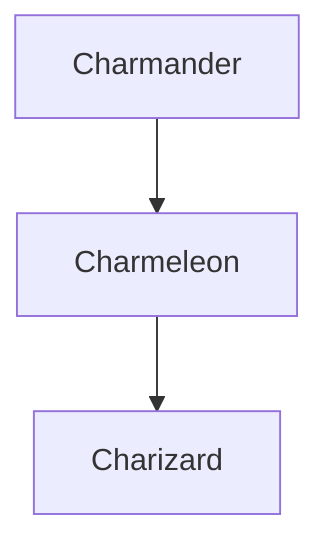
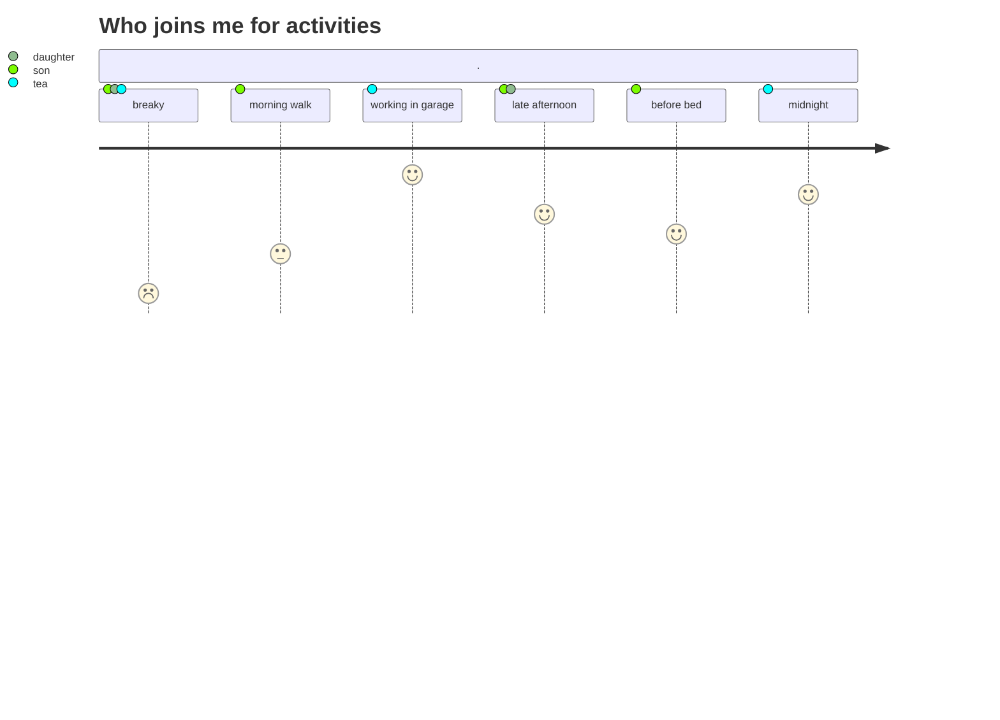
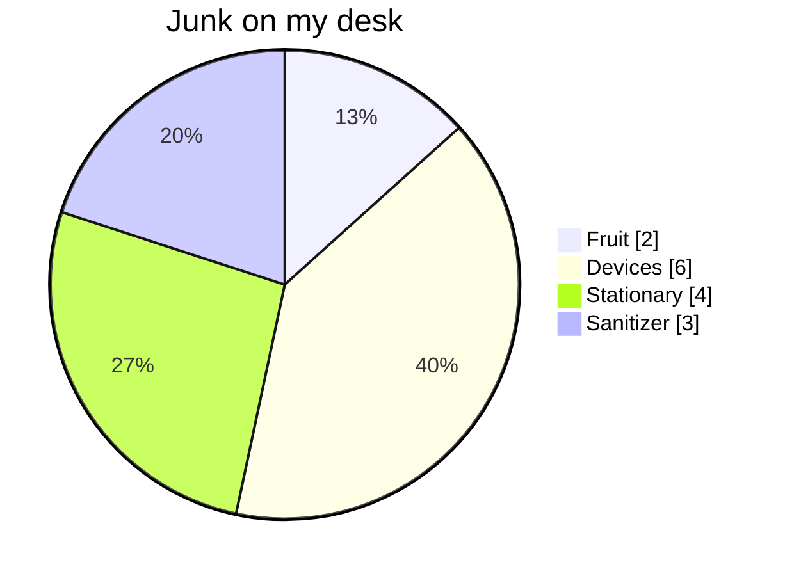
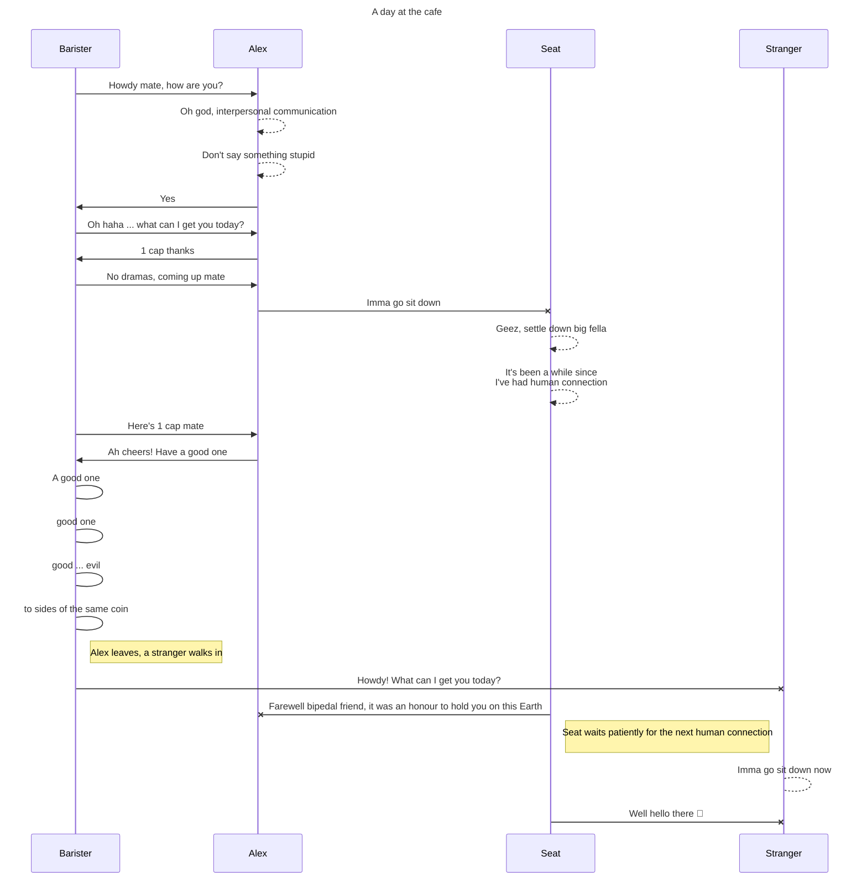

## Flow chart

## Pokemon flow chart

## User journey

## Pie chart

## Sequence diagram

## Links
- https://github.blog/2022-02-14-include-diagrams-markdown-files-mermaid/
- https://mermaid-js.github.io/mermaid/#/README
- https://mermaid-js.github.io/mermaid/#/./integrations
